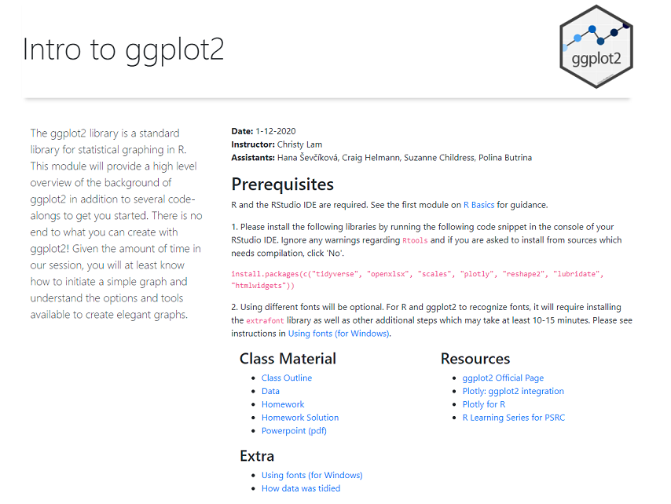

```{r setup, include=FALSE}
knitr::opts_chunk$set(echo = FALSE)
```

I had the opportunity to teach ggplot2 as part of PSRC's virtual [R Learning Series](https://psrc.github.io/r-basics-I/). The R Learning Series began in the Fall of 2020 and consists of 9 modules--each 1.5 hours, to teach staff about R. Topics ranged from the fundamentals to specific packages and statistical methods. 

The course website was created using a mix of Rmarkdown and custom HTML and CSS with Bootstrap styling. 

[](https://psrc.github.io/intro-ggplot2/)


**Event:** R Learning Series 2020-21 @ Puget Sound Regional Council  
**Date:** January 12th, 2021  
[Github Source Code](https://github.com/psrc/intro-ggplot2)


