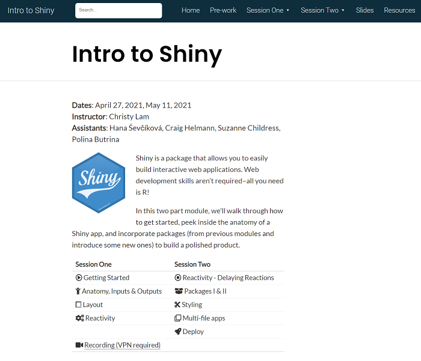

```{r setup, include=FALSE}
knitr::opts_chunk$set(echo = FALSE)
```

After wrapping up the course on ggplot2 in January 2021, I quickly switched gears to prepare for a two-part session on shiny for PSRC's virtual [R Learning Series](https://psrc.github.io/r-basics-I/).

The two-part series totaled a little over 3 hours. Topics ranged from how to get started to building the UI, creating the server logic, styling with packages (`shinythemes`, `bslib`) and CSS, and deployment.

The course website was created using distill and slides were created with `xaringan` and `xaringanextra`.

[](https://psrc.github.io/intro-shiny-guide/)


**Event:** R Learning Series 2020-21 @ Puget Sound Regional Council  
**Date:** April 27, 2021 & May 11, 2021  
[Github Source Code, class material](https://github.com/psrc/intro-shiny)


